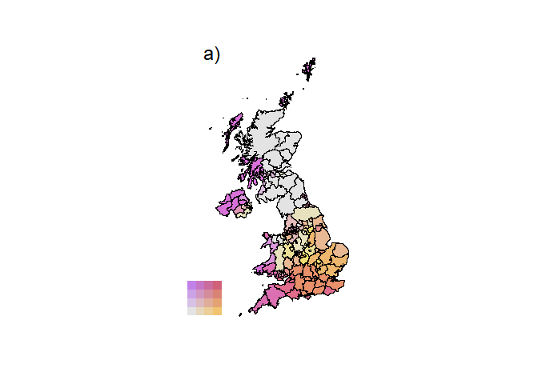

# 🌐 BiVariate_Maps

This repository provides a set of flexible and simple R functions to generate **bivariate raster and polygon maps** using custom color palettes. Designed with ecological modeling and spatial analysis in mind, the toolkit enables users to explore and visualize spatial covariation between two continuous variables.

## 🚀 Features

- `BiColor()`: Generate a perceptually blended bivariate color scale using two user-defined gradients and a neutral center.
- `VarClass()`: Classify continuous raster or vector values into quantile-based discrete classes.
- `biRaster()`: Combine two `SpatRaster` layers into a three-band bivariate map, encoding their spatial relationship into RGB color combinations.
- `biPol()`: Assign bivariate colors to polygon features (`sf`) based on attribute values, ideal for choropleth-style displays.
- `biLegend()`: Render a clean, intuitive color legend showing directional strength of each variable and their interaction.

## 🧭 Applications

These tools are well-suited for:

- Visualizing habitat suitability surfaces  
- Mapping joint patterns of biodiversity and environmental gradients  
- Communicating spatial overlap of two phenomena in conservation planning, land management, or epidemiology

## :exclamation: Requirements

Most of the code relies on basic base-R functionality for processing and handling colour and spatial data. However, it is necessary to install the `terra` and `sf` libraries for the raster processing and spatial representation.

## :computer: Code access

The main functions can be downloaded directly from this repository alongside the working example, or using the following script:

```{r}
# 0. Load/install the needed packages
  list.of.packages<-c("httr","tidyverse")
  
  new.packages <- list.of.packages[!(list.of.packages %in% installed.packages()[,"Package"])]
  if(length(new.packages)) install.packages(new.packages)
  
  lapply(list.of.packages,require,character.only=TRUE)
  # conflicts_prefer(dplyr::filter)
  rm(list.of.packages,new.packages)

# 1. Connect to the AutoMaxent GitHub repository
  git_hub <- "https://api.github.com/repos/BioDivHealth/BiVariate_Maps/git/trees/main?recursive=1"
  MaxRepo <- GET(git_hub) # Extract the repo information
  MaxRepo

# 2. Get the route to the functions
  file_path <- data.frame(unlist(lapply(content(MaxRepo)$tree, function(x) x$path)))
  colnames(file_path) = c('Path')
  head(file_path)

# Extract routes
  file_path <- file_path %>%
    separate(Path,c('folder','filename'),'/') %>%
    filter(folder == 'Functions') %>%
    filter(str_detect(filename,'.R'))

# 3. Configure the routes, download, and export scripts
  raw_route <- "https://raw.githubusercontent.com/BioDivHealth/BiVariate_Maps/refs/heads/main" #This is the raw route to the gitHub repository
  MyRoute <- paste(getwd(),"BiVariate_Maps",sep="/")
  
  for(i in 1:nrow(file_path)){
    write_lines(content(GET(paste(raw_route,file_path$folder[i],file_path$filename[I],sep="/"))),
                paste(MyRoute,file_path$filename[i],sep="/"))
  }

# 4. Load the functions
  functions <- MyRoute %>% list.files(recursive = FALSE,pattern = ".R$",full.names = TRUE)
  lapply(functions,function(x) source(x))
```
In this case, you would need to specify the working environment or working directory before running the code. The **BiVariate_Maps** functions will be stored in the `BiVariate_Maps` folder created in your working environment. Be aware that this script would also install the `httr` and `tidyverse` libraries on your computer unless you modify the code to use only `httr`.

## :mag_right: Some output examples

<figure>

<figcaption aria-hidden="true">Custom Color palettes produced with
BiColor</figcaption>
</figure>

<figure>

<figcaption aria-hidden="true">Relationships between higher nad lowes
temperatures in the UK</figcaption>
</figure>

<figure>

<figcaption aria-hidden="true">Relationships between higher nad lowes
temperatures in the UK’s Ad-units</figcaption>
</figure>

All the figures are generated by the `Example.R` script using open-sourced data.

---

Created with ❤️ and spatial insight.

